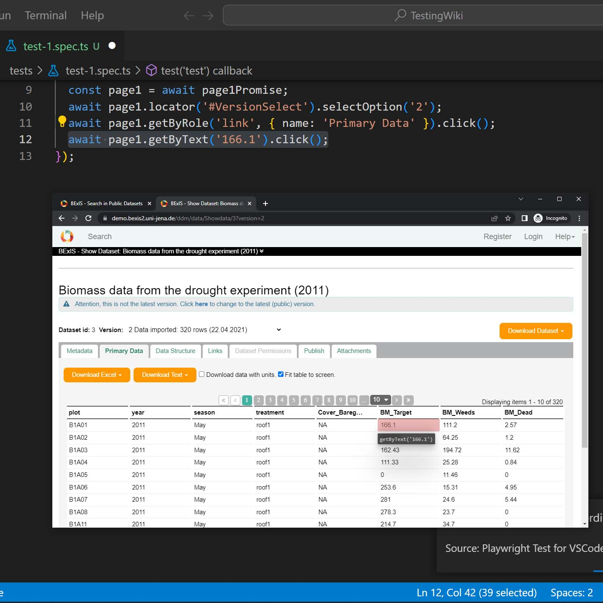

# Assertions
Assertions refer to the validation of perceived behavior of website and features against expected ones. In this file, we will look into the most common and useful assertion types we'll need in our testing.

## Types
To view all the assertion types and some niche cases, Playwright has an informative and helpful page that you can check [here](https://playwright.dev/docs/test-assertions).

### Tutorial
In this tutorial we will:
1. Open BEXIS2 Demo instance.
2. Click on Public Search.
3. Click on the dropdown button.
4. Click on the first dataset.
5. Select the second version from the dropdown menu.
6. Click on Primary Data tab.
7. Choose a value from the table.
8. Choose another value from the table.
9. Check a checkbox on the page.

#### Click on the dropdown button
After landing on the Demo instance's URL and clicking on the Public Search, click on the dropdown button.

Clicking on this button will save the locator which we will use to showcase one of the assertions.


#### Open the second version of first dataset
Choose the first dataset on the page.


On the dataset's page, from the version list dropdown, choose the second item.


#### Validating values listed in the table

Click on the <strong>Primary Data</strong> tab.


From the displayed table click on the first value in the <strong>BM_Target</strong> column.



On the table click on the first value listed under the <strong>plot</strong> column.


Finally, check the checkbox with the label "Download data with units.".


You may now close the browser window and proceed to saving the file.

## Adding validation
Now, we will be replacing some of the lines with assertions to turn our recording into a proper test.

### .toHaveCount()


On the Public Search page there are 2 buttons that both let us choose how many items to be displayed and with the help of the `.toHaveCount()` function, we will be validating that there are 2 instances of it. 

On the 6th line, we will be replacing the code of clicking on the button with validating the number of buttons.

Instead of:
```TypeScript
await page.getByText('10').first().click();
```

We will use: 
```TypeScript
await expect(page.getByText('10')).toHaveCount(2);
```

<em>Note: if there exists a locator function such as `.first()`, or `.nth()`, it shows there are more than one instance of the component on the page.</em>

### .toHaveValue()
On the 10th line we chose the second version from the versions dropdown. We will now add a line to validate our choice.

After the 10th line add the folowing:
```TypeScript
await expect(page1.locator('#VersionSelect')).toHaveValue('2');
```

Now you should have:
```TypeScript
await page1.locator('#VersionSelect').selectOption('2');
await expect(page1.locator('#VersionSelect')).toHaveValue('2');
```

### .toContainText()
To validate a portion of the text exists in a component, we will use `.toContainText()` function.
We will test if the 'B1' substring exists in the first value listed under the <strong>plot</strong> column.

On the 13th line replace the following:
```TypeScript
await page1.getByText('B1A01').click();
```

with:
```TypeScript
await expect(page1.getByText('B1A01')).toContainText('B1');
```

### .toHaveText()
Like the previous, this function will help us in validating the contents displayed on the page. However, to pass the test, the text should be exactly the same, not only a portion.

On the line 12 we clicked on the first value listed under the <strong>BM_target</strong> column:
```TypeScript
await page1.getByText('166.1').click();
```

Modify it as the following:
```TypeScript
await expect(page1.getByText('166.1')).toHaveText('166.1');
```

### .toBeChecked()
When you would like to validate the value of a checkbox, `.toBeChecked()` will be the function to use.

On the 14th line we check the 'Download data with units.' option:
```TypeScript
await page1.locator('#WithUnits').check();
```

We now add a line after it to validate that it is checked:
```TypeScript
await page1.locator('#WithUnits').check();
await expect(page1.locator('#WithUnits')).toBeChecked();
```

### .not
Until now, every assertion validated a positive assertion. How about validating the opposite?

To negate the validation, we simply need to add `.not` in front of any assertion we have mentioned previously.

For example, in the previous example we may remove the 14th line where we checked the box, and replace it with a negated validation to validate it was not checked before.

Instead of:
```TypeScript
await page1.locator('#WithUnits').check();
await expect(page1.locator('#WithUnits')).toBeChecked();
```

We may use:
```TypeScript
await expect(page1.locator('#WithUnits')).not.toBeChecked();
```

We may negate other examples as well with new assertions:
```TypeScript
await expect(page1.getByText('166.1')).not.toHaveText('166');
await expect(page1.getByText('B1A01')).not.toContainText('02');
await expect(page1.locator('#VersionSelect')).not.toHaveValue('1');
await expect(page.getByText('10')).not.toHaveCount(1);
```