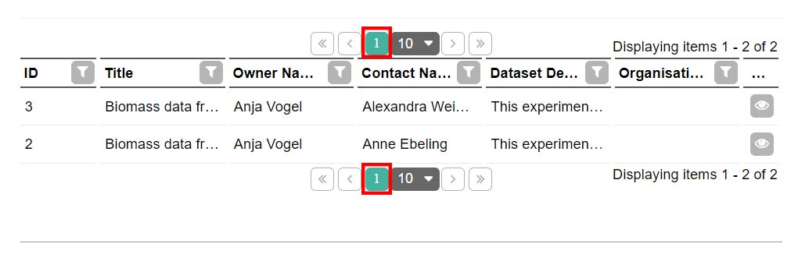

# Failing tests
Written tests will fail if the received result is different from what was expected. However, some errors are not failing because of the assertions, rather some error may have occured on the website. Some common types of errors are mentioned below.

## Slow loading components
When recording Playwright doesn't account for the slow loading components. Thus, adds a locator that is looking for the component that may not have been loaded on immediate visit. In general, Playwright will wait for the components to load for some time, however, there might be cases where the component is loaded after webpage seems ready and test fails.

### .waitForTimeout
We will have look at the test portion and the error it causes:

```TypeScript
await page1.locator('#VersionSelect').selectOption('2');
await expect(page1.locator('#VersionSelect')).toHaveValue('2');

await page1.getByRole('link', { name: 'Primary Data' }).click();

await expect(page1.locator('#VersionSelect')).not.toHaveValue('1');
```

In this portion we simply choose the second version of the dataset and navigate to the <strong>Primary Data</strong> tab and assert that the chosen dataset version is not first one.

We get the below error:


Reason for the error is that the contents of the Primary Data was not loaded when clicked, thus assertion failed as the component was not found on the page.

We might fix the error by adding `.waitForTimeout()` function before opening the Primary Data tab. This will let the contents to load successfully before looking for the component. The function takes an integer amount in miliseconds. We will use 1000ms or a second as the parameter which should give the test enough time to load successfully.

So, we might fix the code with:

```TypeScript
await page1.locator('#VersionSelect').selectOption('2');
await expect(page1.locator('#VersionSelect')).toHaveValue('2');

await page1.waitForTimeout(1000);
await page1.getByRole('link', { name: 'Primary Data' }).click();

await expect(page1.locator('#VersionSelect')).not.toHaveValue('1');
```

And the failing test is now passing:


1000ms may be not enough for some tests or too much for others, in which case you might experiment with other values.

### Timeout exceeded
By default Playwright lets each test to run for 30 seconds. If it is stuck at a place for more than 30 seconds it will finish the test and will report failure.

There are many cases where this error might occur because the page took too long to load, or never loaded or simply the locator is not correct.

In the below example, Playwright fails to find the component for 30 seconds and then fails.


The failing line is:
```TypeScript
await page1.locator('[id="\\34 5_1_LabelContainerMenu"]').getByText('General').click();
```

In this example the line was correct for a previous test but on this page the component doesn't exist thus the test fails.

It is a good practice to record the tests with accuracy, not forgetting any step and avoid copy-pasting unintentionally. In this case to fix the code, one might record again and observe the locator has to be modified as:

```TypeScript
await page1.locator('[id="\\31 _1_LabelContainerMenu"]').getByText('General').click();
```

### False assertion
The types of assertions that are the most important are the ones that fail intentionally revealing there is something wrong with the system. Visual Studio Code will highlight the failing line and explain the error in as much detail as possible.

On the Public Search page of the demo instance we have 2 buttons that navigate to the first page of results:



The test will be as follows:

```TypeScript
await page.goto('https://demo.bexis2.uni-jena.de/');
await page.getByRole('button', { name: 'Public Search' }).click();

await expect(page.getByText('1')).toHaveCount(2);
```

However the test is failing:


Reason for the failure is the wrong choice of the locator. The locator is not specific enough for the assertion to be true. It is counting every component containing 1 in it which is 12 in total.

In this case we need to change our locator to a more specific one:

```TypeScript
await page.goto('https://demo.bexis2.uni-jena.de/');
await page.getByRole('button', { name: 'Public Search' }).click();

await expect(page.locator('.t-state-active:has-text("1")')).toHaveCount(2);
```

To understand failing tests it is necessary to check what was expected result and received and the highlighted portion of code as well as highlighted components on the browser.

### Others
There are many other types of errors that may be unique to the test itself or some niche case where Playwright's abilities are put to the test. In those cases study the errors and try solving it with the known tools. However, if you're stuck, it then may be a good idea to contact someone for help.