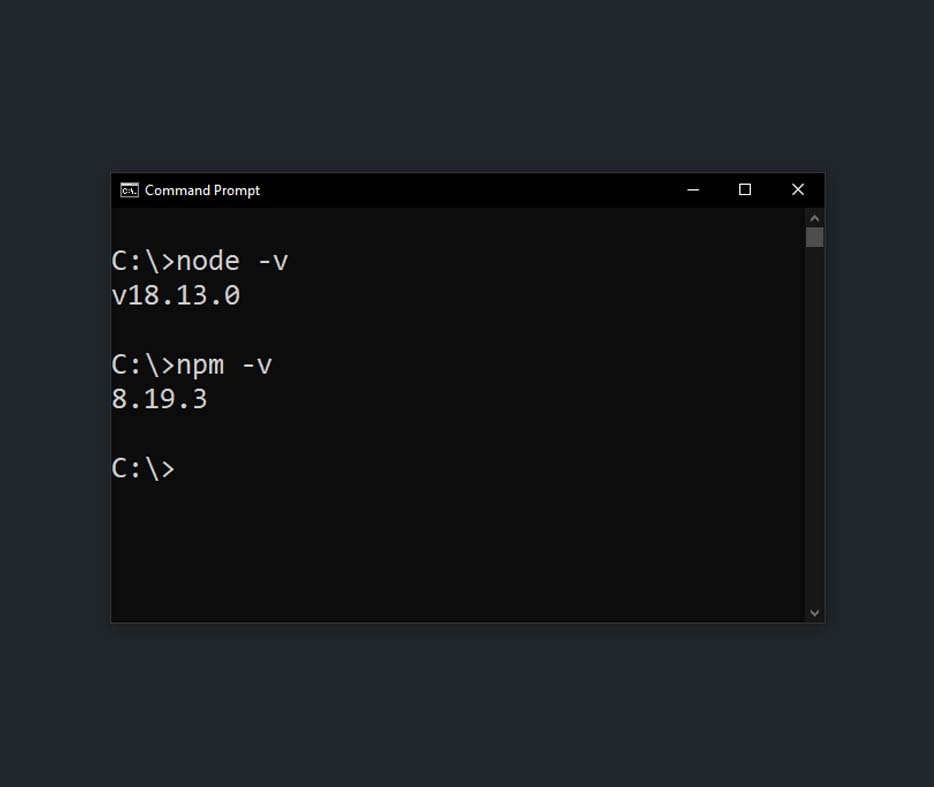
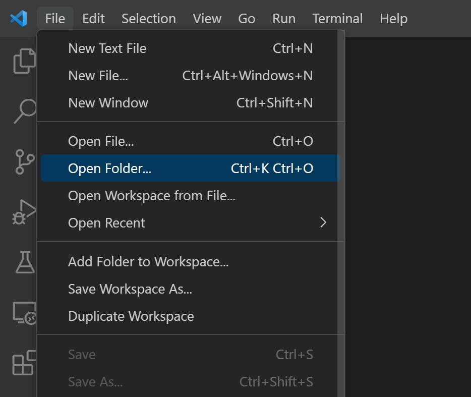
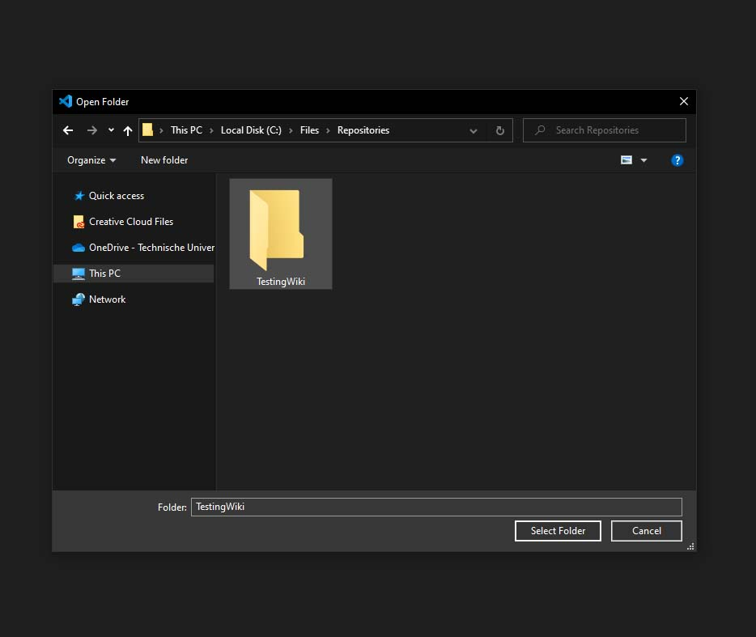
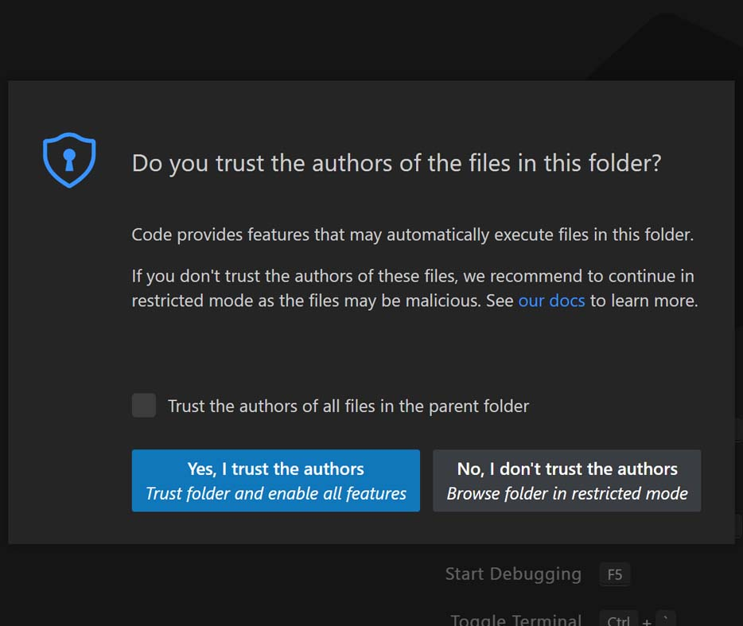
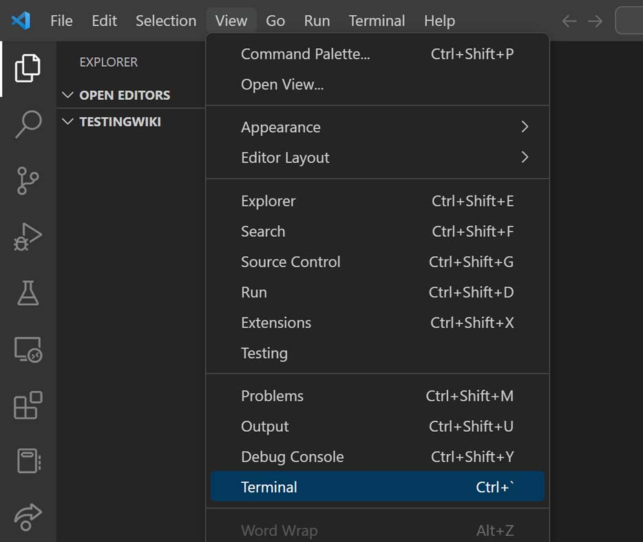
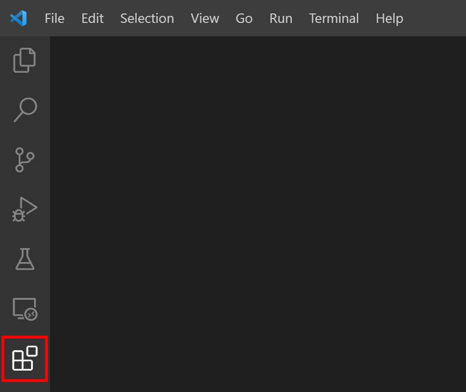
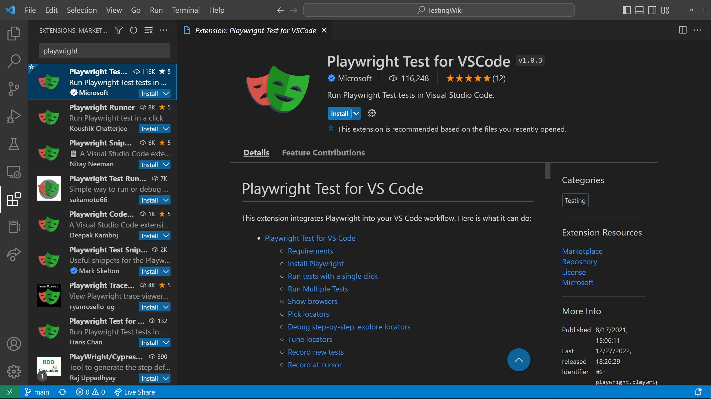
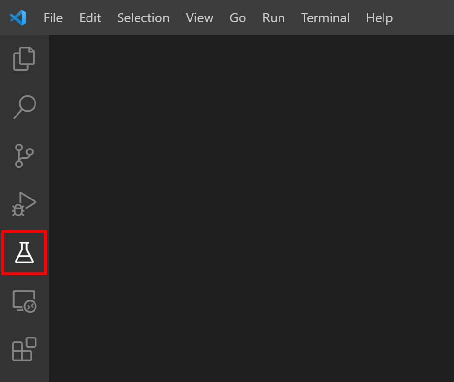

# Recording tests
This repository contains everything you need to start recording tests. Before cloning the repository, you will need to set up your environment.
## NodeJS
Tests are run in a NodeJS server. To be able to run them, first we need to install NodeJS.
1. Head to NodeJS [website](https://nodejs.org/en/) and download the LTS version for your OS.
2. Open the installer and follow through Setup Wizard. You can click Next and continue with the default choices selected. 
3. After the installation is finished you can check your Node installation in a new command prompt (terminal) window by running 
`node -v` which will return a response indicating the version. You can also check your NPM installation with `npm -v` which will print a response with version information.

## Visual Studio Code
To run the tests, we need an IDE where we can edit the files, interact with the testing suite and recording process. Microsoft's Visual Studio Code is packed with necessary features and we will be using it throughout the process.
1. First, you need to [download Visual Studio Code](https://code.visualstudio.com/).
2. Install Visual Studio Code.
## Cloning repository
Cloning process requires a Git installation. You can download a version for your OS in [Git's downloads page](https://git-scm.com/downloads).
To clone this repository into your own machine, follow the below steps:
1. First, create a new folder (location is up to you) for the repository to be cloned into. 
2. In the Visual Studio Code, from the toolbar click on `File` and choose the `Open Folder...` option. 

    

    Then choose the folder you have just created in the opened window. And click on `Select Folder` button on the bottom.

    

3. If you get asked whether you trust the authors, accept it.

    

4. Now open Terminal. From the toolbar, click on `View` then choose `Terminal`.

    

5. To clone the repository, run the below command:

    `git clone https://github.com/iDiv-Data-and-Code-Unit/TestingWiki.git .`

## Installing dependencies
Now that you've cloned repository, you need to install the necessary packages and dependencies to be able to run it.
1. In the integrated Terminal below run the following command:
    
    `npm install`

## Playwright
Playwright is the testing tool that will help us recording and running our tests. It has an interactive Visual Studio Code extension that will help to configure each test run in a user-friendly manner.
1. Locate and open Extensions menu on the left sidebar menu in Visual Studio Code.

    

2. In the opened menu, search for `Playwright`.
3. Install the extension that is verified and developed by Microsoft.

    

4. You may now notice testing menu appear on the left sidebar.

    

## Recording
Now that you have setted up your environment and installed necessary tools, we may start recording tests and implement verification.
You may find tutorial and information on recording and testing in the [RECORDING.md](RECORDING.md) file.
